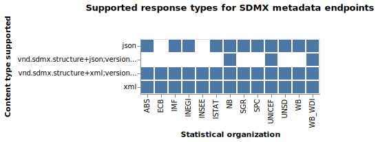

# SDMX Blaze

Goals:

1. Survey a list of SDMX endpoints to determine:
   - SDMX Version
   - Accept headers
2. Scrape SDMX by recursing through resources like dataflows
   - Output WARC for all requests
   - Do HEAD requests for datasets to just calculate estimated size of entire data source
   - Then request real data
3. Eventually, parse SDMX data and convert to standard format, probably CSV.
4. Do this all in a performant service that can be potentially scaled

## Survey results

To run the following Vega analyses, you must:

Run `serve` from NPM with CORS and static serving enabled: `serve -s -C .`

Then you can paste the Vega specs into the [Vega Editor](https://vega.github.io/editor/)

### Nonstandard Metadata APIs

ABS, NBB, OECD, and STAT_EE used software based on an OECD project that generally offered the data in SDMX-compliant formats but had its own REST API for the metadata.

ABS moved to SDMX compliance
STAT_EE moved to a custom solution
NBB unclear, seems to still be nonstandard
OECD kept the same

ABS was thus kept with the new endpoint and the others were removed.

### Analysis of metadata result formats

Surprisingly, all endpoints support JSON metadata except for ECB and INSEE. Because we already have Rust types for JSON, we may simply build out the rest of this crawler without having to deal with the complexities of XML->Rust types conversion.

### Response time analysis

It appears that IMF, UNESCO, and WB have the fastest SDMX endpoint responses. However, this is only based on the `dataflow` metadata request, and it may differ for other metadata requests and data requests.

## Next steps

Testing APIs: IMF, WB, and WB_WDI

It seems that JSON support for metadata is not as widespread as thought before.

Investigate XMLPath and JSONPath to simply extract dataset information.

Try to load an initial batch into TypeSense.
