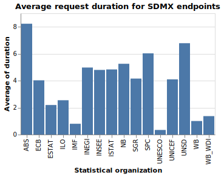

# SDMX Blaze

Goals:

1. Survey a list of SDMX endpoints to determine:
   - SDMX Version
   - Accept headers
2. Scrape SDMX by recursing through resources like dataflows
   - Output WARC for all requests
   - Do HEAD requests for datasets to just calculate estimated size of entire data source
   - Then request real data
3. Eventually, parse SDMX data and convert to standard format, probably CSV.
4. Do this all in a performant service that can be potentially scaled

## Survey results

### Nonstandard Metadata APIs

ABS, NBB, OECD, and STAT_EE used software based on an OECD project that generally offered the data in SDMX-compliant formats but had its own REST API for the metadata.

ABS moved to SDMX compliance
STAT_EE moved to a custom solution
NBB unclear, seems to still be nonstandard
OECD kept the same

ABS was thus kept with the new endpoint and the others were removed.

### Analysis of metadata result formats

### Response time analysis

<!-- debug(datum.elapsed.secs+datum.elapsed.nanos) -->

Run serve statically with CORS enabled: `serve -s -C .`

```
{
  "$schema": "https://vega.github.io/schema/vega-lite/v5.json",
  "title": "Average request duration for SDMX endpoints",
  "data": {"url": "http://localhost:5000/out.json"},
  "mark": "bar",
  "transform": [
    {"flatten": ["elapsed"]},
    {"calculate": "datum.elapsed.secs+datum.elapsed.nanos*10e-9", "as": "duration"}
  ],
  "encoding": {
    "x": {"field": "id", "type": "nominal", "title": "Statistical organization"},
    "y": {"field": "duration", "type": "quantitative", "aggregate": "average"}
  }
}
```


